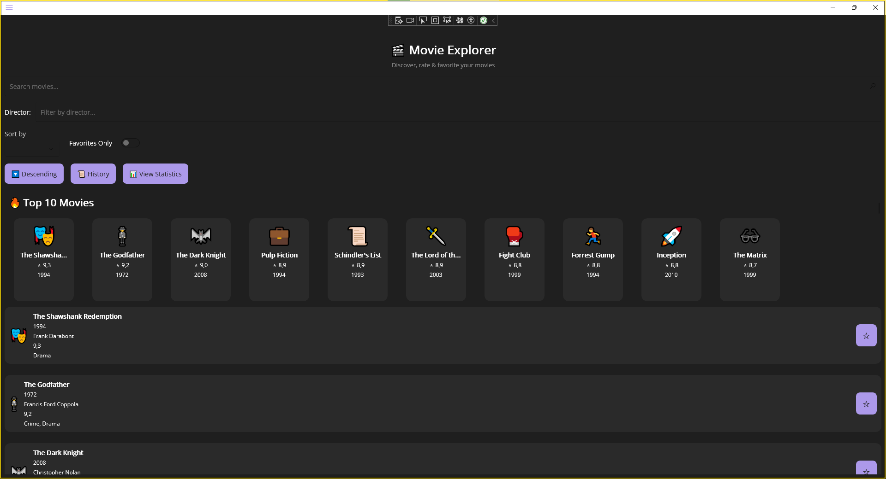
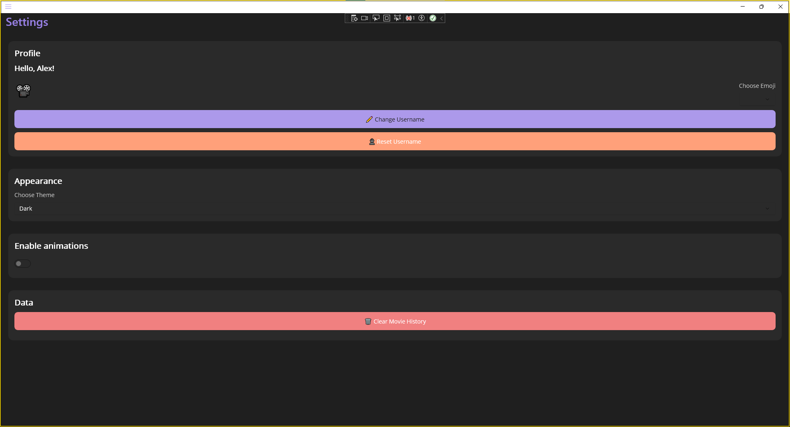
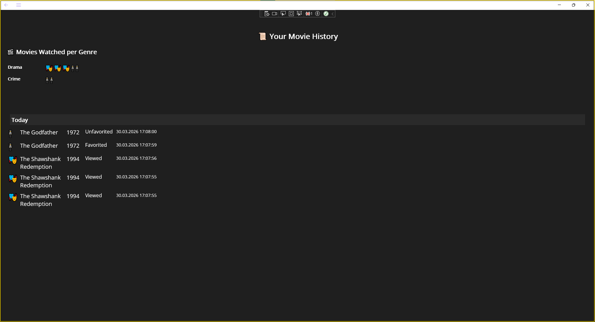
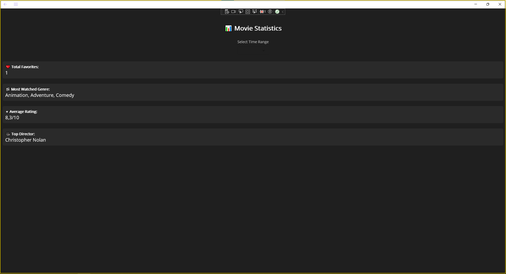

# 🎬 Movie Explorer App

## 📌 Project Description

Movie Explorer is a cross-platform application built using .NET MAUI (.NET 9.0).

The app allows users to browse a collection of movies, search and filter them by different criteria, and manage a personalised list of favourite movies. It also tracks user activity such as viewed and favourited movies, storing this information locally.

This project demonstrates cross-platform development, UI design, data binding, and persistence using .NET MAUI.

---

## 🛠️ Technologies Used

* C#
* .NET MAUI (.NET 9.0)
* XAML (UI design)
* JSON (data storage and API)
* MVVM-style architecture
* Preferences API (user settings)

---

## 🚀 Setup Instructions

### Requirements

* Visual Studio 2022 or later
* .NET 9.0 SDK
* MAUI workload installed (via Visual Studio Installer)

### Steps

1. Clone the repository:

   ```
   git clone https://github.com/Stanislav887/MyProject
   ```
2. Open Visual Studio 2022

3. Click **Open a project or solution**

4. Select the file **MyProject.sln**

5. Wait for dependencies to restore automatically

6. Click **Start (▶)** to run the app

### Running Options

* Windows Machine (recommended)
* Android Emulator or device (if configured)

### First Launch

* Enter your name when prompted
* Movie data is downloaded and cached locally

---

## ▶️ Usage

### First Launch

* Enter your name when prompted
* Movie data is downloaded and cached locally

### Features

* Browse movies with details (title, year, genre, rating, emoji)
* Search and filter by title, genre, year, and director
* Sort movies by rating, year, or title
* Mark/unmark favourites
* View history of actions with timestamps
* View statistics (favourites, genres, ratings, directors)
* Use settings to customise theme, username, and preferences

---

## 🖼️ Screenshots

### 🎬 Main Page


### ⚙️ Settings


### 📜 History


### 📊 Statistics


---

## 🤖 AI Acknowledgment

## AI Tools Used

* ChatGPT (OpenAI)

---

## How AI Was Used

AI tools were used to assist in the development of this project in the following ways:

* Debugging issues in C# and .NET MAUI code
* Understanding concepts such as data binding and MVVM structure
* Improving UI layout and structure in XAML

---

## Specific Examples

* ChatGPT helped debug issues related to:

  * Data binding not updating UI correctly
  * JSON loading and deserialization errors
  * Navigation between pages in .NET MAUI

* Assistance was provided in improving:

  * Search and filtering logic using LINQ
  * Structure of the ViewModel (MovieViewModel)
  * Implementation of history tracking and grouping

* ChatGPT also helped:

  * Refactor parts of the code for better readability
  * Suggest improvements for UI/UX features such as filtering, sorting, and statistics

## 👤 Author

Stanislav Yunakov
